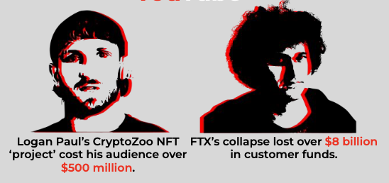
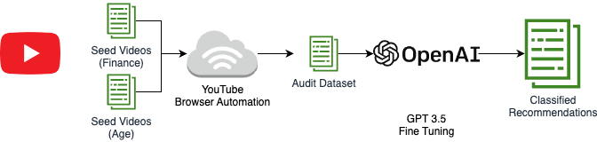

# CryptoWho
Data Science Capstone Project advised under Stuart Geiger

## Authors
#### Brian Huang and Lily Yu

## Overview
In 2020, Bitcoin, other Cryptocurrencies and blockchain investments (NFTs) experienced a major boom. With the endorsements of many major companies and what seemed to be a large scale adoption on the horizon, the Crypto craze had started kicking off.

For many, cryptocurrency and NFTs were the first time they encountered an 'investment'. Many proclaimed crypto/NFT traders had no prior experience with any investing (stock market, retirement accounts, etc.) and looked to crypto/NFT as a get rich quick path. However, with the influx of new and young traders it was only a matter of time before the crypto/NFT scams began to pray on it's new consumers.

While crypto/NFT is not inherently a scam, many bad actors began to manipulate the influx of young and inexperienced investors. Many schemes akin to pump and dumps began to appear and with the popularity of crypto/NFT throughout social media, many inexperienced investors were quick to turn a blind eye to scams that seasoned investors may recognize immediately.

Cases like this have occured with traditional markets as well, where investors pour money into an asset based off of hype with no sound reasoning ($GME or GameStop). Crypto/NFTts however were especially susceptible to this with the combination of a relatively new asset, large demographic of young investors, and many social media influencers promoting these assets (Logan Paul, Doja Cat, etc)

With the most recent scandals in the cryptocurrency/NFT world (FTX, Logan Paul's CryptoZoo), it's more important than ever to investigate the platforms that many of these assets are promoted on. While platforms like YouTube and TikTok may not be intentionally promoting this content, it's important that they're aware of if their algorithms do indeed promote this type of content. To clarify, we do not provide an opinion on whether these scams are run by the founders of these products (FTX's Sam Bankman-Fried and CryptoZoo's Logal Paul) but rather emphasize that the scams have occured.



According to the FTC, over a billion dollars has been lost to these types of scams since 2021. Half of which have orginated directly from social media. The most susceptible group of people? Young individuals.

The goal of this project is to investigate YouTube's recommendation algorithm to provide insight on the types of investment recommendations being provided to users across a variety of age groups. We assume that all individuals should be receiving the same proportion of recommendations based on their search trends (within a margin of error) regardless of age. This implies that a user who is younger and searching for general investment advice should not be receiving more crypto/NFT recommendations than someone who is older with similar watch history. By conducting audits on YouTube, we hope to gain valuable insight on YouTube and it's role in propogating this type of content on their platform (whether intentional or not).

### What does this repository offer?

The repository offers all tools used to conduct the audit. Helper functions and classes help download video and metadata from YouTube, run headless browsers to watch seed videos, and query the GPT-3 API for video sentiment classification.

All code can be found in the `src` folder and imported respectively. For any changes in filepath or settings, please look through the `config` folder.

## Table of Contents

- [Overview](#overview)
- [Methodology](#methodlogy)
- [Installation](#installation)
- [Downloading YouTube Data](#downloading-youtube-video-data)
- [GPT Prompting and Fine-Tuning](#gpt-prompting-and-fine-tuning)
- [Conducting the Audit](#conducting-the-audit)
- [Inference](#running-inference)
- [Analyzing Audit Results](#analyzing-audit-results)
- [Acknowledgements](#acknowledgements)

## Methodology

Our project is split into three parts:

**Part 1: Collecting Seed Videos and Creating Persona Users**

Seed videos function as a way for us to evaluate our GPT model and the videos that users watch to build watch history. Given the time we had, we could only collect and label 140 videos (20 for each age, 40 for traditional investments, 40 for blockchain investments, 5 for mixed, and 15 for edge cases where the video discusses money but is actually unrelated).

These seed videos fall into one of four labels:

Blockchain, Traditional, Mixed, and Unrelated.

Using our seed videos, we create six persona users with different watch behaviors.
```
A young individual (18-23) who:

Watches blockchain

Watches traditional

Watches mixed
```
```
A old individual (55-60) who:

Watches blockchain

Watches tradtional

Watches mixed
```
By comparing the recommendations across these users, we can determine if YouTube is fairly and evenly recommending this content to all age groups. 

**Part 2: Creating a Prompt that peforms the best for our task at hand**

Creating a prompt is important when using GPT as a classifier. More info about our prompt can be found in the sections that follow.

**Part 3: Running the audit**

Using selenium, we can mimic the behavior of the six persona users above. By having a headless browser click and watch each video, we can collect the recommendations of each user. 

Each user watches 50% of the video by default. This and other config can be changed in the `config/Audit.py` file. 

The diagrams below illustrate the general pipeline for our audit:




## Installation

We are using Python version [3.8.5](https://www.python.org/downloads/release/python-385/).

Please install this version of Python, as gensim summarization is still supported.

Versions between 3.8 and 3.9 should work, however we recommend you install the same version we use.

We recommend using [Anaconda](https://www.anaconda.com/) environments to do so.

**Once you've installed Anaconda, please run the following to create your environment.**

```bash
conda create --name <env_name> python=3.8.5
```

**Activate your conda environment like so:**
```bash
# Linux/Mac
source activate <env_name>

# Windows
activate <env_name>
```

**Install required packages**

```bash
pip install -r requirements.txt
```

**If you have Python 3.8.5 working outside of Conda (or any other version of Python that works with gensim) you can create a normal environment if you prefer**

```bash
python3 -m venv .venv

source .venv/bin/activate
```

**Install required packages**

```bash
pip install -r requirements.txt
```

### Headless Browser Setup

We use Selenium with the Firefox Webdriver to conduct our audit and gather YouTube video recommendations.

Note: More recent versions of FireFox will just launch if you have the browser installed. Please install the Firefox browser. If it does not work, install the driver.

To run the scraper, you will need to install the Firefox Webdriver, which can be downloaded [here](https://github.com/mozilla/geckodriver/releases).

To install, place your OS-appropriate executable in a directory locatable by your PATH.

### API Key Setup

Our codebase uses the YouTube Data API to download video metadata, comments, and for many other purposes like searching YouTube and grabbing recommendations. We use the OpenAI API to provide snippets and retrieve classification labels for our downloaded videos.

You can enable the YouTube Data API for your Google account and obtain an API key following the steps <a href="https://developers.google.com/youtube/v3/getting-started">here</a>.

The key can be found after you set up your cloud console.

You can fetch your OpenAI API key from <a href="https://platform.openai.com/">here</a>.

The key can be found in your profile under ***View API Keys***.

Once you have both API keys, please set the ```YOUTUBE_DATA_API_KEY``` and ```OPENAI_API_KEY``` variable in your environment:

You can do so by going to your home directory and running the following command:

**Mac OS and Linux**

```
nano .bash_profile

# Note Mac Users using zsh shell users should also set their keys in their zsh_profile
nano .zsh_profile
```

Inside your bash profile, you can go ahead and set this at the top:

```
# YOUTUBE API KEY
export YOUTUBE_DATA_API_KEY="YOUR_API_KEY"
export OPENAI_API_KEY="YOUR_API_KEY"
```

Close out of your terminal and your code editor to see changes occur.

**Check that updates have been made**
```
echo $YOUTUBE_DATA_API_KEY
echo $OPENAI_API_KEY
```

The following tutorials cover how to do this as well:

https://www.youtube.com/watch?v=5iWhQWVXosU&t=1s (Mac/Linux)

https://www.youtube.com/watch?v=IolxqkL7cD8 (Windows)

If you are not seeing updates, your `bash_profile` may not be sourced. To resolve this, add the following line to your `.bashrc`:

```
. ~/.bash_profile

# Note Mac Users using zsh shell users should do this in .zshrc
. ~/.zsh_profile
```

This can be anywhere, but we've put ours at the very bottom. Use the following command to enter your `.bashrc`.

```
nano .bashrc
# Note Mac Users using zsh shell users should do this
nano .zshrc
```

Now within Python you can access your API key by doing the following:
```
import os

youtube_key = os.environ.get("YOUTUBE_DATA_API_KEY")
openai_key = os.environ.get("OPENAI_API_KEY")
```

### Connecting to a VPN

To ensure all things are constant, we connected to the UC San Diego VPN for all of our audits and downloads. We recommend you connect to a VPN in the same location as well. There are many different VPN providers.

### Preserving User Agent

We recommend the audits be done on the same device, and if that is not possible, the same operating system. All of our audits were conducted on a Ubuntu device, however the platform you choose to audit with should not matter as long as they are consistent.

## Running The Entire Project Pipeline (Not Recommmended)

Our code uses a `run.py` file to help you run our code out of the box. You have the option to run the entire project pipeline using the folliwng command:

`python run.py all`

This command will download all seed videos, create snippets and evaluate your seed videos using the classifier, conduct the audit and download all videos, and classify the videos from the audit.

We **DO NOT** recommend you run this. The entire pipeline may take multiple days to run depending on the size of your seed videos. (Note: With 140 seed videos, our entire pipeline takes three days to run.)

If you would like to validate that the pipeline and it's sub-targets work, we instead recommended using:

`python run.py test`

Which will run the pipeline end to end on a much smaller subset of data found in `test/youtube`. This takes around an hour.

You can continue reading below for more details, but here is an overview of all targets in the run.py file. They are listed in the order we recommend you run them. Running each target gives you finer control over what is downloaded, avoiding repeated efforts/wasted API calls.
```
seed - The following target downloads and processed seed data. Target will prompt user for what they want to download and if they want to process the seed data (create video snippets.) Video snippets for context is a concatenation of the video title + summarized transcript (via TextRank) + top ten video tags (via TF-IDF)

classify-seed - The following target classifies the seed videos, providing a baseline classification report of your prompt. The confusion matrix is saved in references/figures. Note that the classification report is printed in terminal and not saved.

audit - The following target conducts the audit on a Firefox headless browser. It allows you to run a single or multiple audits. Config for each audit can be found in config/Audit.py

download-audit - The following target allows you to download the results of your audit. You can choose to download homepage results, sidebar results, or both.

create-audit-snippets - The following target creates snippets for each set of audit results. Note this may take a while as some videos have large transcripts. Video's over an hour have no transcript removed, however by modifying the target code this can be removed if you are able to wait the additional time.

classify - Run classification on your audit snippets.
```

## Downloading YouTube Video Data
Using `python run.py seed` will download all seed videos and save it in `data/seed/youtube/videos_{}.csv`.

Using `python run.py download-audit` will download all videos from the audit and save the downloaded videos in `data/audit/youtube/videos_{}.csv`.

Calling `python3 src/data/youTubeDownloader.py <video_ids seperated by spaces>` will download any videos you want and save it in `data/external/youtube/videos_{}.csv`. 

## GPT Prompting and Fine Tuning
Unlike traditional classifiers, GPT-3 is not trained on an existing dataset. Instead, predictions are generated through a set of 'prompts', instructing the large language model what the task is.

At the start of this project, GPT-3 was used. GPT-3 can be fine-tuned using a labelled dataset and prompts. For those interested in using a fine-tuned GPT-3 model, we encourage you to use the following <a href="https://platform.openai.com/docs/guides/fine-tuning">resource</a>.

Starting March 1st, GPT-3.5 was released. This API powers ChatGPT. Due to significant reduction in cost and increases in accuracy, we migrated to <a href = "https://platform.openai.com/docs/models/gpt-3">GPT 3.5.</a>

You are open to modify the prompt for our model however you see fit. The prompt can be found in `gpt.py` in the `create_message()` function.

The following prompt was used for our classification:
```
{"role": "system", "content" : 

"You are a classifier that determines if a YouTube video snippet falls under a label. A snippet is a concatenation of the video title, summarized transcript, and video tags. The labels and additional instructions will be included in the first user message."},

{"role": "user", "content" : 

"""Labels:

Traditional: Videos that recommend or educate about stocks, bonds, real estate, commodities, retirement accounts, or other traditional investments or keywords related to them.
Blockchain: Videos that recommend or educate about cryptocurrency (BTC, ETH, etc.), NFTs, or other Web3 investments or keywords related to them.
Mixed: Videos that recommend or educate about both blockchain and traditional investments or keywords related to both.
Unrelated: Videos that do not recommend or educate about either blockchain or traditional investments or keywords related to them.

Instructions:
- The classifier should consider the context and meaning of the keywords used to determine whether the snippet is related to traditional or blockchain investments.
- If talks about making money from jobs, side hustles, or other alternative assets (cars, watches, artificial intelligence, trading cards, art, etc), they are Unrelated.
- A video that is only downplaying an investment or discussing it negatively should be classified as Unrelated.
- Please return predictions in the format" {Label} : {20 word or shorter rationale}"""},

{"role": "assistant", "content": 

"""Understood. I will classify YouTube video snippets based on the provided labels and instructions. Here's how I will format the predictions:

    {Label} : {20-word or shorter rationale}

Please provide me with the YouTube video snippet you would like me to classify."""}
```
Note that unlike GPT-3, the ChatCompletions API endpoint expects a message, not a prompt. The system message biases the model towards a specific task, while the user messages provide prompts and instructions. The assistant messages can be used to affirm what has already been stated in the user messages.

You can test out your prompt on your seed videos!

`python run.py classify-seed`

This will run classification on the seed videos and return a classification report and confusion matrix. The confusion matrix can be found in `references/figures`.

More information on writing prompts can be found <a href = "https://github.com/openai/openai-cookbook">here</a>

Note: Occasionally, the output of a prediction will be 'Label'. This is due to GPT not adhering to the format we instruct it to. There is no known fix to this as of now.

For example:
```
### Expected Output
Blockchain: Rationale

### Occasional Output
Label: Blockchain: Rationale
```

By default, our seed classifier will mark videos with a prediction of 'Label' as unrelated. This may result in accuracy being off by 1-2% when in reality it should be higher. Please inspect your output yourself to verify!

## Conducting the Audit

The audit may take a very long time to run. Please make sure you're connected to a VPN before you start. We recommend using some program to keep your computer awake (Caffeine, Amphetamine). 

If you are using `python run.py audit`, the audit will prompt you if you want to conduct a single audit or all audits (in our case six audits.)

If you choose one audit, the one audit will be run based on these parameters in `config/Audit.py`
```
# AUDIT VARIABLES
USER_AGE = "old"  #'young' or 'old'
FINANCE_VIDEO_TYPE = "blockchain"  #'traditional', 'blockchain', 'mixed'
```

If you choose multiple audits, the code will iterate through the following dictionary in `config/Audit.py`, sleeping ten minutes between each audit.
```
AUDITS = [
    {"type": "traditional", "age": "young"},
    {"type": "mixed", "age": "young"},
    {"type": "blockchain", "age": "young"},
    {"type": "traditional", "age": "old"},
    {"type": "mixed", "age": "old"},
    {"type": "blockchain", "age": "old"},
]
```

After running the audit, please run:

```python
python run.py download-audit

python run.py create-audit-snippets
```

Audits are saved to `data/audit` with the following sub-folders:
```
raw - The raw video information. Please only keep the results of one run in this folder, as the pre-processing scripts read the entire directory to load in files. Having multiple audits in the folder will result in overriden and missing files in data cleaning steps.

processed - The downloaded videos. The sub-folder `snippets` contains the downloaded videos with snippets appended.

results - The results of our predictions.
```

## Running Inference

Running inference on the audit videos is easy!

`python run.py classify`

Running the following command with run classification on every single audit file. Results are stored in `data/audit/results/`.

## Analyzing Audit Results

GPT models use a parameter called 'temperature' to adjust how much risk their models take. 0 temperature means the model is deterministic, outputting the same response everytime. We've used a temeprate of 0.25 as we want the model to take a bit of risk. This, however, does resukt in cases where our predictions come back in the wrong format.

For example:
```
### Expected Output:

Blockchain: This video is blockchain

### Occassional Output:

Label: Blockchain: This video is blockchain
```

Because of this, we can not include a target for analyzing the results. It's much easier to analyze the result on your own through a notebook. We have a reference notebook: `notebooks/insepectPredictions.ipynb` that demonstrate loading in the result data, cleaning it, and running a Chi-Squared test. Please use that for reference. You can also generate any plots you need using `matplotlib` and `seaborn`. 

## Acknowledgements

We'd like to make a special thanks to the Data Science Capstone faculty, HDSI, Professor Stuart Geiger, and all our friends and family who provied us the opportunity to work on this project.